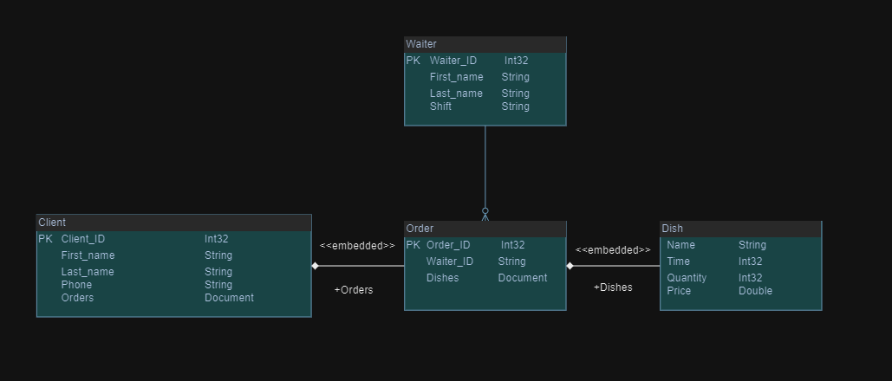

# Restaurant Management with MongoDB

This project demonstrates a simple restaurant management system implemented using Python and MongoDB. It allows you to manage clients, waiters, and their orders within a restaurant database.

## Features

- Add clients and their orders to the database
- Add waiters to the database with their shifts
- Display client information by name
- Calculate the total amount spent by a client
- Calculate a waiter's total revenue and display their served customers and orders

